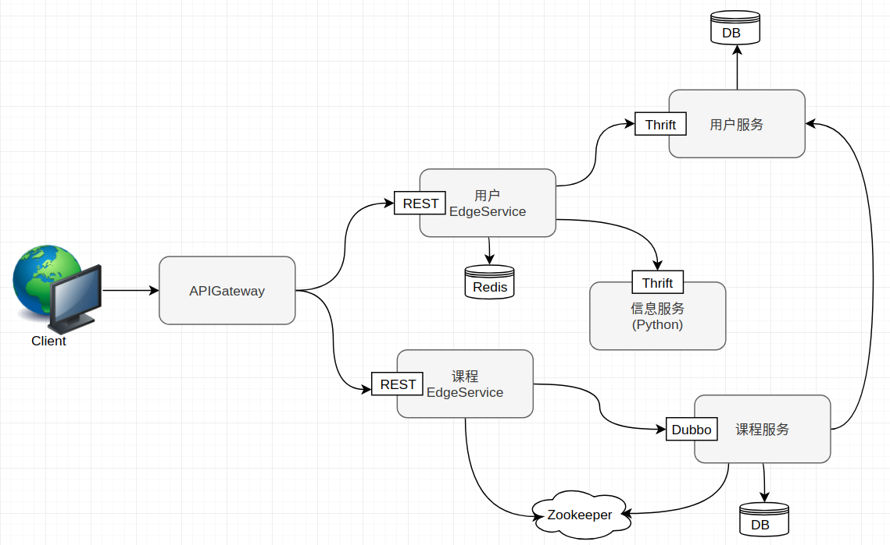
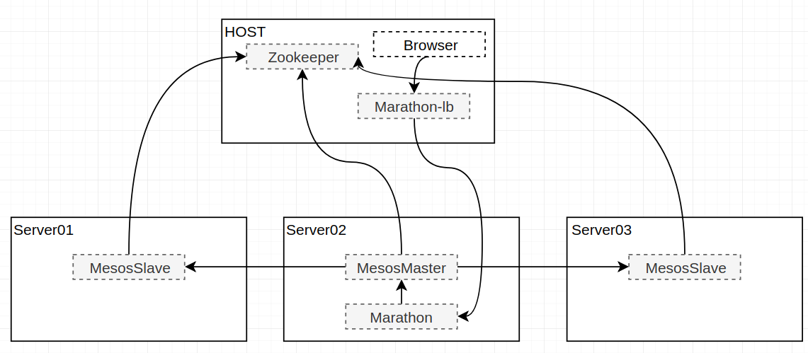
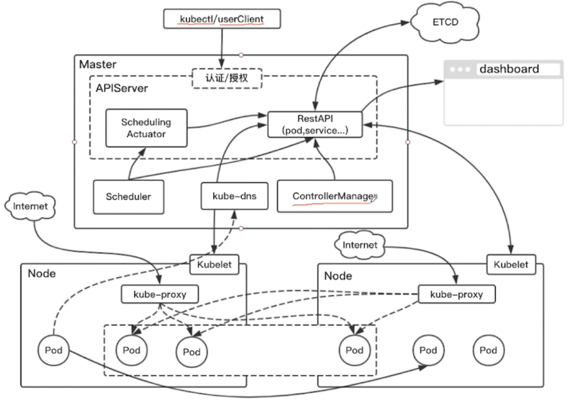

# 模块

## 用户服务

- 用户登录
- 用户注册
- 用户基本信息查询
- 无状态, 无session

## 课程服务
- 登录验证
- 课程的curd

## 信息服务
- 发送邮件
- 发送短信

## 用户edgeservice
## 课程edgeservice
## API GATEWAY

# Docker化
[Ubuntu安装Docker ](https://docs.docker.com/install/linux/docker-ce/ubuntu/)

基本镜像

 ```bash
docker pull openjdk:8-jre
docker run -it --entrypoint bash openjdk:8-jre
 ```

把外部服务的配置设为参数
```
spring.datasource.url=jdbc:mysql://${mysql.address}:3307/db_user
```
内部服务则是换成服务名

```
thrift.user.ip=user-service
```


pom中添加插件

```xml
            <plugin>
                <groupId>org.springframework.boot</groupId>
                <artifactId>spring-boot-maven-plugin</artifactId>
                <executions>
                    <execution>
                        <goals>
                            <goal>repackage</goal>
                        </goals>
                    </execution>
                </executions>
            </plugin>
```

然后进行`mvn clean package`．注意此时要先对父pom进行`mvn install`

写Dockerfile

```
FROM openjdk:8-jre
MAINTAINER nnkwrik nnkwrik@gmail.com

COPY target/user-thrift-service-1.0-SNAPSHOT.jar /user-service.jar

ENTRYPOINT ["java","-jar","/user-service.jar"]
```

命令行运行Docker

```
docker build -t user-service:lastest .
docker run -it user-service:latest --mysql.address=192.168.0.5
```

## docker-compose
```bash
docker-compose up -d
docker-compose up -d message-service // 重启某个服务
docker-compose down
```
## 镜像仓库
### 公有仓库

```bash
docker tag zookeeper:3.5  nnkwrik/zookeeper:3.5
docker login
docker push nnkwrik/zookeeper:3.5
docker pull nnkwrik/zookeeper:3.5
```

### 私有仓库

没有交互界面, 多台生产环境时不容易管理
```bash
docker pull registry:2 
docker run -d -p 5000:5000 registry:2 
docker tag zookeeper:3.5 localhost:5000/zookeeper:3.5  
docker push localhost:5000/zookeeper:3.5 
docker pull localhost:5000/zookeeper:3.5
```

### harbor

改harbor.cfg,后 `sudo ./install.sh`
```bash
hostname = hub.nnkwrik.com
```

/etc/hosts中添加

```
127.0.0.1		hub.nnkwrik.com
```

```
docker login hub.nnkwrik.com
docker tag openjdk:8-jre   hub.nnkwrik.co/micro-service/openjdk:8-jre
docker push hub.nnkwrik.com/micro-service/openjdk:8-jre
```

TODO

- Docker-compose化后python的消息服务无法使用

# Mesos



搭建3个vm

```
192.168.0.6		server02
192.168.0.4		server01
192.168.0.7		server03
192.168.0.5		host
```


```
sudo apt-get install docker.io
sudo apt-get install openssh-server
```

### server02(mesos master)

```bash
ubuntu@server02:~$ docker pull mesosphere/mesos-master:1.7.0
sh mesos.sh
```

改hostname , vim /etc/hosts , 127.0.1.1   -->  192.168.0.6     server02

mesos.sh(https://github.com/mesosphere/docker-containers/tree/master/mesos)

```
#!/bin/bash

docker run -d --net=host \
  -e MESOS_PORT=5050 \
  -e MESOS_ZK=zk://192.168.0.5:2181/mesos \
  -e MESOS_QUORUM=1 \
  -e MESOS_REGISTRY=in_memory \
  -e MESOS_LOG_DIR=/var/log/mesos \
  -e MESOS_WORK_DIR=/var/tmp/mesos \
  -v "$(pwd)/log/mesos:/var/log/mesos" \
  -v "$(pwd)/work/mesos:/var/tmp/mesos" \
  mesosphere/mesos-master:1.7.0
  --ip=192.168.0.6 --work_dir=/var/lib/mesos --hostname=192.168.0.6
```

### server01/server03(mesos slave)

```
docker pull mesosphere/mesos-slave:1.7.0
```

同样改hostname , vim /etc/hosts

mesos-slave.sh

```
#!/bin/bash

docker run -d --net=host --privileged \
  -e MESOS_PORT=5051 \
  -e MESOS_MASTER=zk://192.168.0.5:2181/mesos \
  -e MESOS_SWITCH_USER=0 \
  -e MESOS_CONTAINERIZERS=docker,mesos \
  -e MESOS_LOG_DIR=/var/log/mesos \
  -e MESOS_WORK_DIR=/var/tmp/mesos \
  -v "$(pwd)/log/mesos:/var/log/mesos" \
  -v "$(pwd)/work/mesos:/var/tmp/mesos" \
  -v /var/run/docker.sock:/var/run/docker.sock \
  -v /sys:/sys \
  -v /usr/bin/docker:/usr/local/bin/docker \
  mesosphere/mesos-slave:1.7.0 --no-systemd_enable_support
```

### server02(marathon)

```
docker pull mesosphere/marathon:v1.6.549
```

marathon.sh(https://hub.docker.com/r/mesosphere/marathon/)

```bash
#!/bin/bash

docker run -d --net=host \
 mesosphere/marathon:v1.6.549 \
 --master zk://192.168.0.5:2181/mesos \
 --zk zk://192.168.0.5:2181/marathon
```

### host(marathon lb)

```
docker pull mesosphere/marathon-lb:v1.12.3
```

start.sh

```
#!/bin/bash

docker run -d -p 9090:9090 \
 -e PORTS=9090 mesosphere/marathon-lb:v1.12.3 sse \
 --group external \
 --marathon http://192.168.0.6:8080
```

### 部署

marathon,连接方式设为桥接,切换到Port, json mode修改成以下, 切换到Labels `HAPROXY_GROUP=external`

    "portMappings": [
      {
        "containerPort": 9090,
        "protocol": "tcp",
        "servicePort": 10002
      }
此时部署出错,  在slave的/etc/docker/daemon.json添加harbor

```
{
  "insecure-registries" : ["hub.nnkwrik.com"],
  "dns" : ["192.168.0.6"]	#看情况加
}
```

TODO

- 用marathon分配到slave的服务,镜像每过几十秒就会重启, 

# Docker Swarm

搭建3个vm

```
192.168.0.6		server01
192.168.0.4		server02
192.168.0.7		server03
192.168.0.5		host
```

### server01

创建为manager

```bash
root@ubuntu:/home/ubuntu# docker swarm init --advertise-addr 192.168.0.06
Swarm initialized: current node (j3dgiy8ao35641lyxerdwdp21) is now a manager.

To add a worker to this swarm, run the following command:

    docker swarm join \
    --token SWMTKN-1-5x02lj77yb92idsrnzzg9c09ieie8to9yxf0k62gwmw4c19wjy-8m5dxordls6iw4vgpzt6mavj5 \
    192.168.0.06:2377

To add a manager to this swarm, run 'docker swarm join-token manager' and follow the instructions.
```

#### Server02/03,加入swarm

```
    docker swarm join \
    --token SWMTKN-1-5x02lj77yb92idsrnzzg9c09ieie8to9yxf0k62gwmw4c19wjy-8m5dxordls6iw4vgpzt6mavj5 \
    192.168.0.06:2377
```

### 让三个节点是SwarmNode的同时也是SwarmManager

#### Server01

```
docker node ls #确认节点
docker node promote server02	#升级为manager
```

### 创建服务

```bash
docker service create --name test1 alpine ping www.baidu.com
docker service ls	#查看服务
docker service inspect test1	#查看详细信息
```

```bash
docker service create --name nginx nginx
docker service update --publish-add 8080:80 nginx	#暴露端口
#http://192.168.0.6:8080/,http://192.168.0.4:8080/,http://192.168.0.7:8080/ 都可访问
```

### 服务的高可用

```bash
docker service scale nginx=3
docker service ls
docker service ps nginx
```

以上是ingress网络

### 自定义的网络

```bash
docker network create -d overlay imooc-overlay
docker service create --network imooc-overlay --name nginx -p 8080:80 nginx
docker service create --network imooc-overlay --name alpine alpine ping www.baidu.com
docker service ls
```

自定义就能从alpine容器中`ping nginx`.ingress则不行,(mode = vip)

此时,不仅能在外部通过ip访问,也能在服务间用服务名访问

### dnsrr

只需要通过名字在容器间访问时使用. 外部无法访问

```bash
docker service create --name nginx-b --endpoint-mode dnsrr nginx
docker service update --network-add imooc-overlay nginx-b
```

```bash
docker service ls
docker service rm d8ufvhgsyb8g eln k7p #删掉目前的服务
```

### stack

定义一个组,设置相互依赖的关系, 类似于compose

server01, service.yml

```yaml
version: "3.4"
services:
  alpine:
    image: alpine
    command:
      - "ping"
      - "www.baidu.com"
    networks:
      - "imooc-overlay"
    deploy:
    # endpoint_mode: dnsrr
      replicas: 2
      restart_policy:
        condition: on-failure
      resources:
        limits:
          cpus: "0.1"
          memory: 50M
    depends_on:
      - nginx

  nginx:
    image: nginx
    networks:
        - "imooc-overlay"
    ports:
        - "8080:80"

networks:
  imooc-overlay:
    external: true
```

```bash
docker stack deploy -c service.yml test
docker stack ls	#确认
docker stack services test
docker service ls
```

### swarm微服务部署

server01,创建swarm-service.yml

```
docker stack deploy -c swarm-service.yml ms
```

### 负载均衡

让他能均衡访问三个vm中的api-gateway

```bash
#server01
docker pull nginx
docker run -idt -p 80:80 -v `pwd`/nginx.conf:/etc/nginx/conf.d/default.conf nginx
```

nginx.conf

```bash
upstream nnkwrik{
    server 192.168.0.06:8080;
    server 192.168.0.04:8080;
    server 192.168.0.07:8080;
}

server {
    listen       80;
    server_name  www.nnkwrik.com;

    #charset koi8-r;
    #access_log  /var/log/nginx/host.access.log  main;

    location / {
        proxy_pass http://nnkwrik;
    }

    #error_page  404              /404.html;

    # redirect server error pages to the static page /50x.html
    #
    error_page   500 502 503 504  /50x.html;
    location = /50x.html {
        root   /usr/share/nginx/html;
    }
}
```

在host设置域名`192.168.0.6     www.nnkwrik.com`后,可从浏览器通过域名访问


# k8s



vm

```
192.168.0.6		server01	worker
192.168.0.4		server02	master
192.168.0.7		server03	worker
192.168.0.5		host
```

环境搭建参考https://github.com/liuyi01/kubernetes-starter

### 常用操作

```bash
#安装了kubectl的节点，这里为master节点
$ kubectl version
$ kubectl get nodes	#获取所有节点的信息
$ kubectl get pods	
```
运行官方提供的示例
```bash
#运行官方提供的示例
$ kubectl run kubernetes-bootcamp --image=jocatalin/kubernetes-bootcamp:v1 --port=8080
$ kubectl get deploy	#查看当前该节点中所有的部署项
$ kubectl get pods -o wide	#查看pod的详细信息
#$ kubectl delete deploy kubernetes-bootcamp	#删除部署项
```
在worker中查看工作的pods
```bash
#部署成功后在相应的worker节点
$ docker ps	#能查到被分配的部署项
$ journalctl -f	#查看日志
```

获取详细信息
```bash
#安装了kubectl的节点，这里为master节点
$ kubectl describe deploy kubernetes-bootcamp	#查看部署项的详细信息
$ kubectl get pods
$ kubectl describe pods kubernetes-bootcamp-6b7849c495-9w5dj	#查看pod的详细信息
```

如何访问部署的服务?
```bash
$ kubectl proxy	#开一个proxy
Starting to serve on 127.0.0.1:8001
#另外开一个bash ,用curl运行以下就能得到响应
$ curl http://127.0.0.1:8001/api/v1/proxy/namespaces/default/pods/kubernetes-bootcamp-6b7849c495-9w5dj/
Hello Kubernetes bootcamp! | Running on: kubernetes-bootcamp-6b7849c495-9w5dj | v=1
```

扩缩容

```bash
$ kubectl scale
$ kubectl scale deploy kubernetes-bootcamp --replicas=4
$ kubectl get deploy	#此时数量已变成4
$ kubectl get pods
```

更新镜像

```bash
#更新成v2(同样名字)
$ kubectl set image deploy kubernetes-bootcamp kubernetes-bootcamp=jocatalin/kubernetes-bootcamp:v2
#查看更新状态
$ kubectl rollout status deploy kubernetes-bootcamp
$ kubectl get deploy	#此时镜像已变成v2
```

撤回操作

```bash
#错误的镜像
$ kubectl set image deploy kubernetes-bootcamp kubernetes-bootcamp=jocatalin/kubernetes-bootcamp:v20
#回滚操作
$ kubectl rollout undo deploy kubernetes-bootcamp
```

### 配置文件

用配置文件也能统一管理,类似swarm

- 创建一个pod

nginx-pod.yaml

```yaml
apiVersion: v1
kind: Pod
metadata:
  name: nginx
spec:
  containers:
    - name: nginx
      image: nginx:1.7.9
      ports:
        - containerPort: 80
```

```bash
$ kubectl create -f nginx-pod.yaml	#创建
$ kubectl get pods	#查看新建的nginx的pod
$ kubectl get deploy	#查不到nginx,因为创建的是pod
```

尝试访问

```bash
$ kubectl proxy
Starting to serve on 127.0.0.1:8001
#另外开一个bash ,用curl运行以下能得到响应
$ curl http://127.0.0.1:8001/api/v1/proxy/namespaces/default/pods/nginx/
```

- 创建一个deployment

nginx-deployment.yaml

```yaml
apiVersion: apps/v1beta1
kind: Deployment
metadata:
  name: nginx-deployment
spec:
  replicas: 2
  template:
    metadata:
      labels:
        app: nginx
    spec:
      containers:
      - name: nginx
        image: nginx:1.7.9
        ports:
          - containerPort: 80
```

```bash
$ kubectl create -f nginx-deployment.yaml	#创建
$ kubectl get deploy	#查看新建的nginx-deployments
$ kubectl get pods -l app=nginx	#指定labels,查看pods. 会有两个
```

### Service (kube-proxy)

```bash
$ kubectl get services	#查看所有的服务, 
$ kubectl describe service kubernetes	#查看详情
```

用kube-proxy访问service

```bash
$ kubectl expose deploy kubernetes-bootcamp --type="NodePort" --target-port=8080 --port=80
$ kubectl get services	#此时能看到新添加的kubernetes-bootcamp
NAME                  TYPE        CLUSTER-IP     EXTERNAL-IP   PORT(S)        AGE
kubernetes-bootcamp   NodePort    10.68.82.153   <none>        80:33353/TCP   24s
#此时在worker上使用 netstat -ntlp|grep 33353 , 会看到处于监听状态
```

- 33353(node port) : 实际在worker节点上启动的端口, 这里是随机生成的
- 8080(--target-port) : 容器实际监听的端口
- 80(--port) : 在CLUSTER-IP(10.68.82.153)中实际访问时的端口

从外部访问服务

```bash
$ curl 192.168.0.6:33353	#从外部访问worker的端口, 能返回结果
$ curl 192.168.0.7:33353
```

从CLUSTER-IP访问 或从 pod的ip 访问,如

```bash
#在worker中,进入kubernetes-bootcamp的容器
$ docker exec -it 22a848f7e511 bash
$ curl 10.68.82.153:80	# CLUSTER-IP,服务的端口
Hello Kubernetes bootcamp! | Running on: kubernetes-bootcamp-7689dc585d-hn88d | v=2
#甚至能访问别的pod
#从有kubectl的节点使用 kubectl get pods -o wide, 查到nginx的pod的ip为172.20.40.197
$ curl 172.20.40.197:80	#pod的ip,容器的端口
```

- 配置文件的方式创建

能指定实际在节点上启动的端口(上次随机创建的是33353)

nginx-service.yaml

```yaml
apiVersion: v1
kind: Service
metadata:
  name: nginx-service
spec:
  ports:
    - port: 8080
      targetPort: 80
      nodePort: 20000
  selector:
    app: nginx
  type: NodePort
```

创建
```bash
$ kubectl create -f nginx-service.yaml
$ kubectl get svc	#查看新创建的Service
nginx-service         NodePort    10.68.177.199   <none>        8080:20000/TCP   1m

$ curl 192.168.0.6:20000	#都能返回
$ curl 192.168.0.7:20000
```

### kube-dns

查看创建的kube-dns

```bash
$ kubectl -n kube-system get svc	#kube-system 内部的命名空间
NAME       TYPE        CLUSTER-IP   EXTERNAL-IP   PORT(S)         AGE
kube-dns   ClusterIP   10.68.0.2    <none>        53/UDP,53/TCP   2m
$ kubectl -n kube-system get pods
NAME					 READY     STATUS    RESTARTS   AGE
kube-dns-6c85d6648c-44qhb   3/3       Running   0          3m
$ kubectl -n kube-system get pods -o wide
NAME                        READY     STATUS    RESTARTS   AGE       IP             NODE
kube-dns-6c85d6648c-44qhb   3/3       Running   0          4m        172.20.188.6   192.168.0.6
```

尝试访问

```bash
$ docker exec -it 22a848f7e511 bash	#进入boot-camp的容器
$ curl nginx-service:8080	#可以访问, 8080是容器监听的端口
$ curl 10.68.177.199:8080	#也是nginx-service,通过CLASTER-IP访问
```

可以看出dns就是把域名解析为CLASTER-IP

### 其他指令 

需要配CA
```bash
$ kubectl run kubernetes-bootcamp --image=jocatalin/kubernetes-bootcamp:v1 --port=8080
$ kubectl logs kubernetes-bootcamp-6b7849c495-fml4j	#查看pod的日志
$ kubectl exec -it kubernetes-bootcamp-6b7849c495-hbkbc bash	#进入容器
```

apply
```bash
$ kubectl apply -f nginx-pod.yaml	#类似create.但对于已存在的应用,apply是对其进行更新
$ kubectl describe pod nginx	#Annotations部分和create不同
# apply会把最近生成的配置内容记录到Annotations
$ kubectl get pods nginx -o json	#查看完整的Annotations部分
$ kubectl set image pods nginx nginx=nginx:1.7.9	#当然这样也能更新配置,但是Annotations部分还是原来的
```

总结访问方式

```bash
$ kubectl apply -f nginx-service.yaml
$ kubectl apply -f nginx-deployment.yaml

#从nodePort访问service
$ curl  192.168.0.6:20000	
$ curl  192.168.0.7:20000

# 从CLUSTER-IP访问Service
$ kubectl run busybox --rm=true --image=busybox --restart=Never --tty -i	#测试用的沙盒, ..用不了
#通过进另一个容器的方式访问
$ docker exec -it 4666249dac64 bash	#worker中的容器
$ curl 10.68.15.126:8080	#ok
$ curl nginx-service:8080	#ok.因为dns
```

### 服务添加到k8s

在worker节点添加harbor

```bash
{
  "insecure-registries" : ["hub.nnkwrik.com"]
}
```

master节点,启动服务

```bash
$ kubectl apply -f message-service.yaml
$ kubectl apply -f user-service.yaml
$ kubectl apply -f course-service.yaml
$ kubectl apply -f api-gateway.yaml	#此时报错, 说port得是20000-40000
```

修改端口限制

```bash
$ vi /lib/systemd/system/kube-apiserver.service
#  把 --service-node-port-range=20000-40000 \ 改成 80-40000
$ systemctl daemon-reload	#重启
$ service kube-apiserver restart
$ kubectl apply -f api-gateway.yaml	#ok
```

浏览器访问

```
http://192.168.0.7/course/courseList
http://192.168.0.7/course/courseList
```

:smile:

TODO

- 消息服务依然有问题,
- dubbo获取不到provider, 导致空指针异常